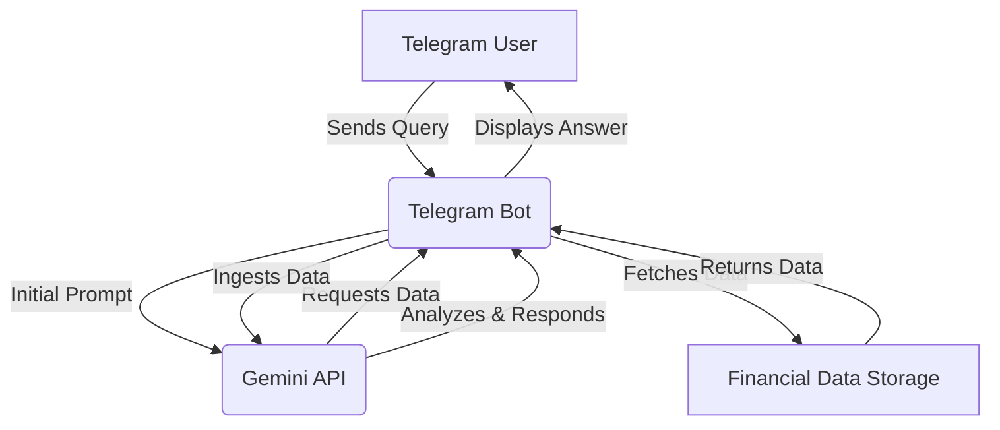

# Gemini API Integration Plan for Spending and Budgeting Analysis

This plan outlines the steps to integrate the Gemini API for custom spending and budgeting analysis, enabling a Telegram bot to leverage Gemini's capabilities for financial insights.

## 1. Environment Variable Setup

*   **Objective:** Securely store the Gemini API key and selected model.
*   **Action:**
    *   Add `GEMINI_API_KEY` to the `.env` file.
    *   Add `GEMINI_MODEL` (e.g., `gemini-pro`) to the `.env` file.
    *   Ensure `budget_bot.py` and any other relevant scripts can access these environment variables.

## 2. Integration Layer Design (Telegram Bot & Gemini API)

*   **Objective:** Create a robust layer that facilitates communication between the Telegram bot and the Gemini API.
*   **Components:**
    *   **Telegram Bot Listener:** Listens for user queries related to financial analysis.
    *   **Data Fetcher Module:** Responsible for retrieving financial data (transactions, budgets) based on Gemini's requests. This module will interact with the existing financial data storage (e.g., a database or local files).
    *   **Gemini API Client:** A module to handle authentication and requests to the Gemini API.
    *   **Data Ingestion & Formatting:** A component to format the fetched financial data into a structure suitable for Gemini's input.
    *   **Response Handler:** Processes Gemini's output and formats it for user-friendly display via the Telegram bot.

## 3. Data Flow and Analysis Workflow

*   **Objective:** Define the end-to-end process from user query to Gemini's response.
*   **Workflow:**

    1.  **User Query:** User sends a financial question to the Telegram bot (e.g., "Am I on track to make my grocery bill this month?").
    2.  **Bot Receives Query:** The Telegram bot receives the message.
    3.  **Initial Gemini Prompt:** The bot sends an initial prompt to Gemini, including the user's question and context about available data (e.g., "User asked: 'Am I on track to make my grocery bill this month?' I can provide transaction and budget data.").
    4.  **Gemini's Data Request:** Gemini analyzes the prompt and determines what data it needs (e.g., "I'm going to need the past 6 months of groceries transactions and budget numbers.").
    5.  **Bot Fetches Data:** The Data Fetcher Module retrieves the requested data from the financial system.
    6.  **Data Ingestion to Gemini:** The fetched data is formatted and sent to Gemini.
    7.  **Gemini Analysis:** Gemini ingests the data, performs analysis (e.g., calculates averages, compares spending to budget), and generates an answer.
    8.  **Gemini Response:** Gemini returns the analytical response to the bot.
    9.  **Bot Displays Answer:** The Response Handler formats Gemini's answer and sends it back to the user via Telegram.

## 4. Example Scenario Walkthrough

*   **User:** "Am I on track to make my grocery bill this month?"
*   **Bot to Gemini (Initial Prompt):** "User query: 'Am I on track to make my grocery bill this month?' Available data: transactions, budgets."
*   **Gemini to Bot (Data Request):** "Please provide the past 6 months of grocery transactions and budget data."
*   **Bot Fetches Data:** Retrieves relevant transaction and budget entries.
*   **Bot to Gemini (Data Ingestion):** Sends the structured financial data.
*   **Gemini Analysis:** Reviews data, identifies spending patterns (e.g., 6 trips/month, $50/trip average), compares current spending (2 trips) to historical data and budget.
*   **Gemini to Bot (Response):** "You're actually on track to save money as you've spent less and are tracking to continue spending less this month than previous months."
*   **Bot to User:** Displays Gemini's response.

## 5. Architectural Diagram

## Next Steps:

*   Implement environment variable loading.
*   Develop the Gemini API client.
*   Create the data fetching and ingestion logic.
*   Integrate with the existing Telegram bot.